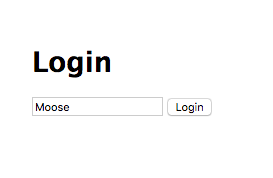

# CRUD Applications

## Goal

The goal of this exercise is to give you your first full CRUD application experience. CRUD is short for Creat, Read, Update, and Delete. These are the basic database/API actions and are used in every Bits of Good Product. To say you'll be building a CRUD application means your final product should have the ability to create, read, update, and delete information. Normally this is done with a database, but for the sake of simplicity we'll just store information in a `data.js` file.

The goal of the Guestbook application you will build is allow users to login, view posts and create new posts.

### Getting started

1. Install npm dependencies

    ```bash
    npm install
    ```

2. Start your server

    ```bash
    npm start
    ```

3. Visit [http://localhost:3000/](http://localhost:3000/) to make sure that your server is working.
4. Edit your routes (aka `POST` or `GET` endpoints) in `/05_express/2_guestbook/app.js`.
5. Edit your css rules in `/05_express/2_guestbook/public/css/style.css`.

### Saving data

When users create or edit posts, save them using `data.save(posts)`.
To read saved data back use `data.read()`.

`data.save(posts)` takes one argument that is an array of guestbook post objects.
`data.read()` returns an array of guestbook post objects.

Each guestbook post is represented by an object with the following properties:

1. `author`
1. `date`
1. `title`
1. `body`

### Part 1: Login

1. Implement the `GET /login` endpoint in `/05_express/2_guestbook/app.js`.
1. Add an HTML form with `method="POST"` and `action="/login"`
  to `/05_express/2_guestbook/views/login.hbs`. This login form should contain
  a single `<input>` element of `type="text"` and `name="username"`
  and [a submit button](http://www.w3schools.com/html/html_forms.asp)

Your login page should look like:



When you click the `Login` button you should see this (Don't worry if you don't see the username - you'll implement that in Part 2):


### Part 2: View posts

#### Endpoint: `GET /posts`

1. Implement the `GET /posts` endpoint in `/05_express/2_guestbook/app.js`.
1. Use Handlebars `{{each}}` to display posts in `/05_express/2_guestbook/views/posts.hbs`.

### Part 3: Create post

1. Implement the `GET /posts/new` endpoint in `/05_express/2_guestbook/app.js`.
1. Add an HTML form here with `method="POST"` and `action="/posts"`.
  to `/05_express/2_guestbook/views/post_form.hbs`.
  This login form should have input elements for title, body and date and a
  submit button.
1. Implement the `POST /posts` endpoint:
    - If the user is not logged in, respond with `401` status code and display an
    error.
    - If any of body, title or date are missing (or empty) respond with a `400`
    status code and display an error.
    - If the form contents are valid, create a new post object and store it
    using `data.save()`.

### Part 4: Sort posts

Make it possible to sort posts by date using a URL parameter.

1. Add a request parameter `order` to the `GET /posts` endpoint in
   `/05_express/2_guestbook/app.js`.

   `/posts?order=ascending` should display posts in chronological order (oldest
   first).

   `/posts?order=descending` should display posts in reverse chronological order
   (newest first).

1. Add 2 links to `/05_express/2_guestbook/views/posts.hbs` to sort posts in ascending or
  descending order.

### Part 5: Filter by author

1. Add a request parameter `author` to the `GET /posts` endpoint in
   `/05_express/2_guestbook/app.js`. When this parameter is specified, only posts
   belonging to the specified author should be displayed.
1. Update `/05_express/2_guestbook/views/posts.hbs`, add a link next to each post to
  "View only posts by this author" that takes you to
  `/posts?author=name-of-author-here`
1. When posts are being filtered by author, add a link to `posts.hbs` to
  "View posts by all authors" again.
1. Make sure it's possible to sort and filter posts simultaneously.
  `/posts?order=ascending&author=Moose` should work.

### Bonus Part: Styling

Use [Bootstrap](http://getbootstrap.com/) to style your views (i.e. your pages).
You can download Bootstrap into `/05_express/2_guestbook/public/`. The contents
of this folder are accessible all templates.

Use [Bootstrap form elements](http://getbootstrap.com/css/#forms)
and add inline form validation messages like this:


### Double Bonus Part: Admin interface

Implement a Guestbook Admin Interface that can:

  1. Edit post
  1. Delete single post
  1. Delete all posts by author

### Triple Bonus Part: Markdown

Render Markdown posts using [Marked](https://github.com/chjj/marked)
